# jh_flutter_demo

[](https://flutter.dev)
[](https://dart.dev)
[](LICENSE)
[](https://github.com/iotjin/jh_flutter_demo/releases/)


## [English](README.md) | 简体中文

A new Flutter project - 实现一些常用效果、封装通用组件和工具类 <br>
<br>

pwd：123456

代码不定期更新
<br>
<br>

## 在线预览

https://iotjin.github.io/jh_flutter_demo

## 项目运行环境

* Flutter version 3.10.0
* Dart version 3.0.0


## 实现的一些效果

* 通用框架搭建、通用基类实现
* 字体、颜色、Frame、字符串等宏定义
* dio网络请求封装
* API接口管理和数据管理
* 路由模块化管理
* 屏幕适配
* 暗黑模式(DarkMode)适配
* 主题切换
* 组件
  * BaseAppBar、BaseTabBar、BaseRefreshView、BaseWebView
  * 弹框(中间、底部、toast、dialog、自定义弹框)
  * 时间、日期、单列、多列、底部选择器
  * 级联选择器（多维数组或树形结构、支持搜索）
  * JhForm 表单录入(单行多行输入样式、选择样式、设置样式、登录样式)
  * JhTopTabBar(导航条分页切换)
  * 渐变色导航条、多行标题导航条
  * 仿微信右上角弹框
  * 倒计时按钮
  * APP更新弹框
  * 基于微信UI的图片/视频选择器(支持拍照及录制视频)
  * 拍照、本地图片多选、九宫格展示、全屏查看图片
  * 文本高亮显示指定文本
  * 空数据和网络异常
  * 骨架屏
  * 水平滑动菜单(效果同拼多多首页、淘宝我的频道)
  * 轮播图(全屏、缩放)
  * 抖动、缩放、位移动画
* 工具类
  * AES加解密、MD5加密、base64编码解码
  * 本地数据AES加密存储
  * 实时网络监测
  * 获取设备信息、屏幕信息、刘海屏判断
  * 加载图片资源、颜色设置
  * 状态栏设置
  * 二维码扫描与生成
  * 导航路由跳转
  * 监听页面出现或消失
  * 时间格式转换
  * 字符串处理
  * 随机数
  * 退出APP/跳转应用商店
  * 防抖/节流
* UI相关
  * ListView相关(分页上下拉刷新、分组上下拉刷新、分组吸顶)
  * GridView相关
  * Chart相关(多图表动态加载、渐变折线图、折线柱状图混合图表)
  * 小红点
  * 导航条搜索框和header搜索框
  * Animation(标签云)
  * 列表侧滑按钮
  * 城市选择列表
  * ListView/GridView拖拽排序
  * 富文本
  * 登录注册
  * 版本新特性
  * 检查更新
  * 仿微信UI（首页，通讯录，发现和个人中心等）
  * 导航条图片下拉放大和渐变效果(微信运动排行榜，个人主页)
  * 微信朋友圈和图片浏览
  * 十字滑动(个人中心效果)


注：
* 封装的组件和工具类都在`jh_common`文件夹
* 更多请下载工程查看

<br>


## 注意事项

* debug模式下会有部分卡顿现象，这属于正常现象。良好的体验需要打release 包。 iOS可以执行命令`flutter build ios` 以创建release版本。 Android可以执行命令`flutter build apk` 以创建release版本。
* iOS14真机运行闪退，可通过 `flutter run --release` 真机运行

## <a id="更新记录"></a> 更新记录
<details open id="重要更新">
  <summary><strong>重要更新</strong></summary>

```
* v3.10.0 - 更新三方库和flutter版本（Flutter 3.10.0，Dart 3.0.0）
* v3.7.0  - 更新三方库和flutter版本（Flutter 3.7.0，Dart 2.19.0）
* v3.3.0  - 更新三方库和flutter版本（Flutter 3.3.0，Dart 2.18.0），iOS最低构建版本改为11.0
* v3.0.0  - 更新三方库和flutter版本（Flutter 3.0.0，Dart 2.17.0）
* v2.10.1 - 暗黑模式(DarkMode)适配
* v2.10.0 - 更新三方库和flutter版本（Flutter 2.10.0，Dart 2.16.0）
* v2.0.0  - 更新 Flutter SDK（ 2.0.3 ）和依赖库
* v1.0.0  - 环境：Flutter version 1.22.3，Dart version 2.10.3
```
</details>


## 赞赏支持


* 如果您觉得还不错，或者我的开源项目对您有所帮助，可以点右上角“Star”支持一下，您的支持就是我的动力，谢谢🙂
* 您也可以扫描下面的二维码，请作者喝杯奶茶 🧋

<br>


<br>

## 预览

部分页面效果如下：


<br>
<br>
<br>


<br>
<br>
<br>

## 微信UI：

| 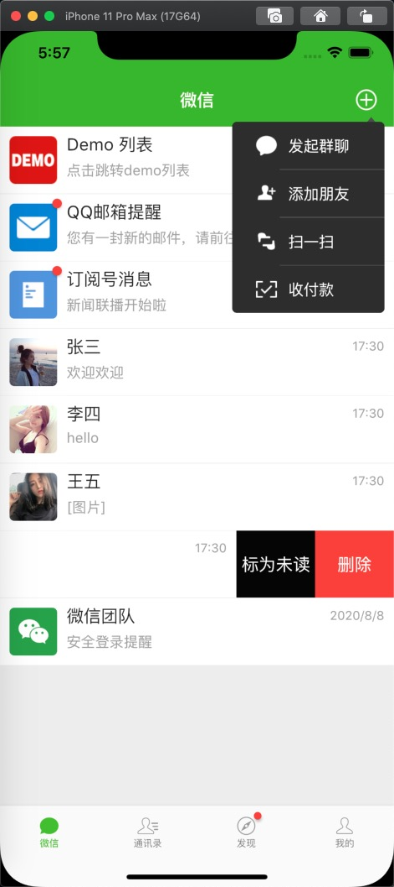    |  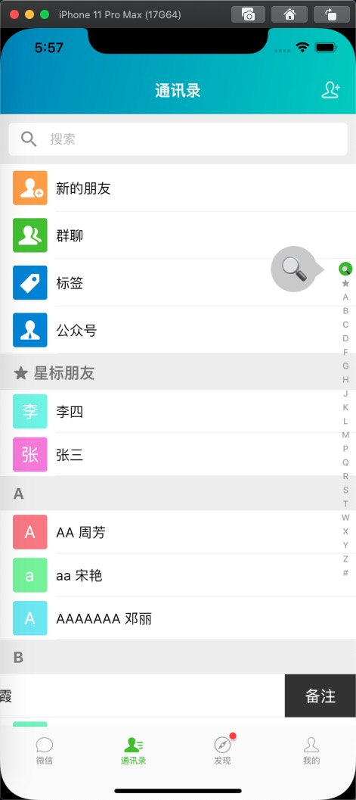    | 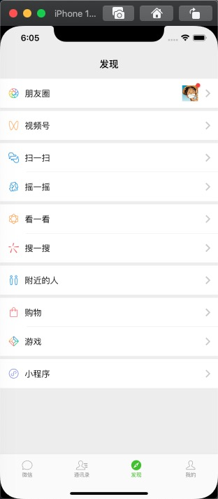   |  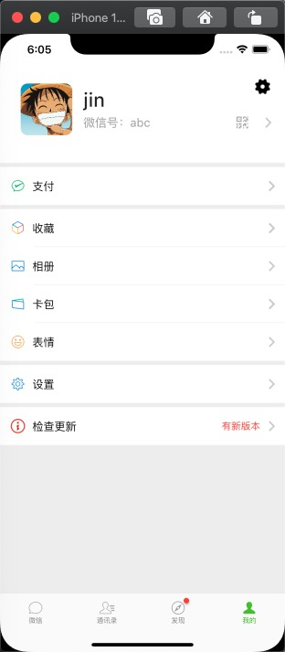   |
| :--------------------------------: | :---------------------------------: | :-------------------------------: | :-------------------------------:  |
|             |  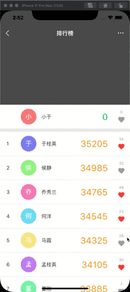        | 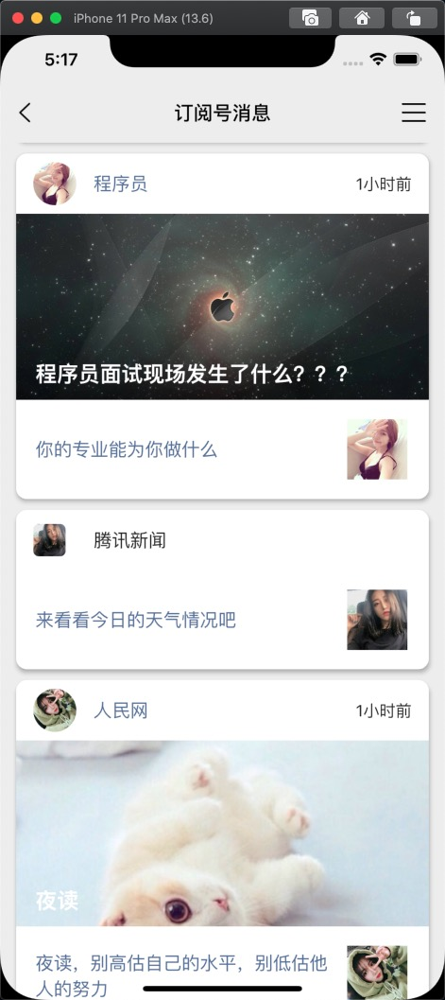    |         |
|  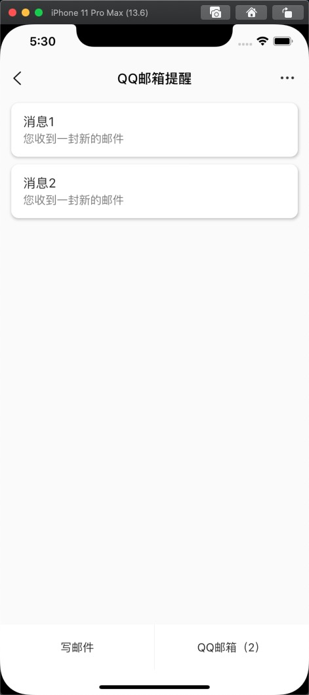   |  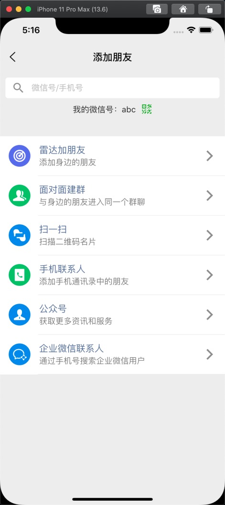    | 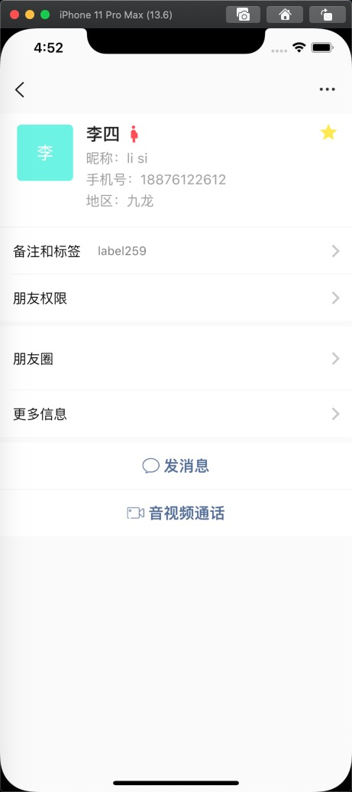          |  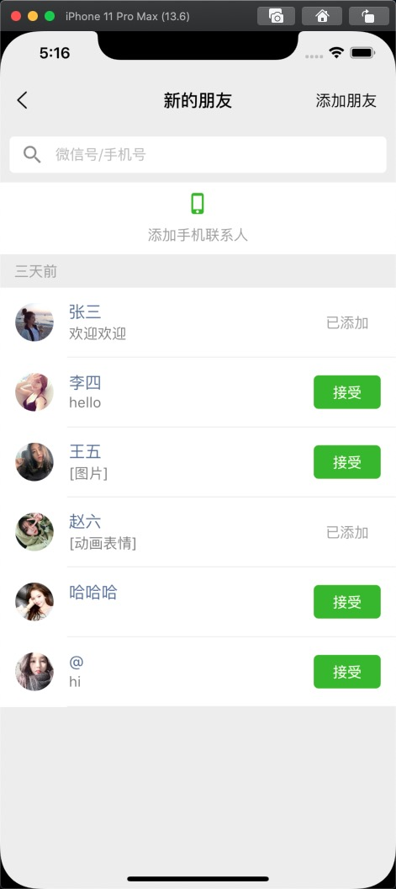               | 
| 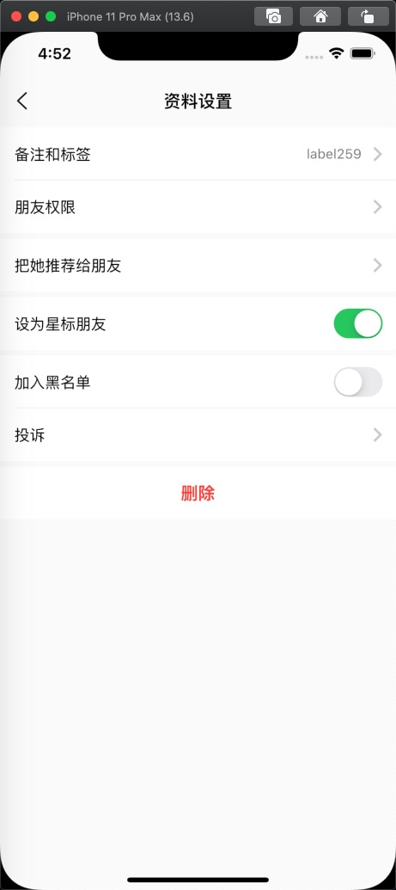       |  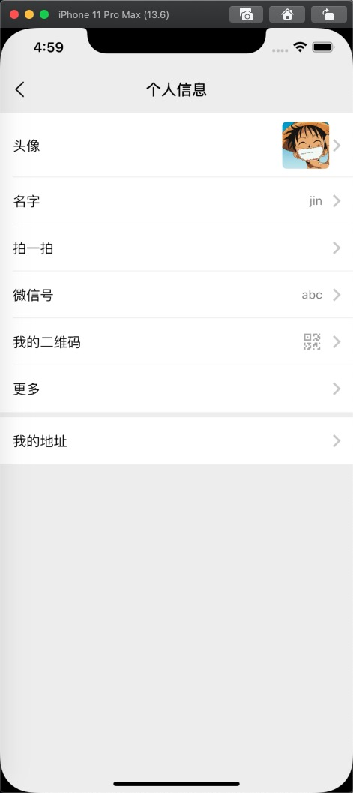         | 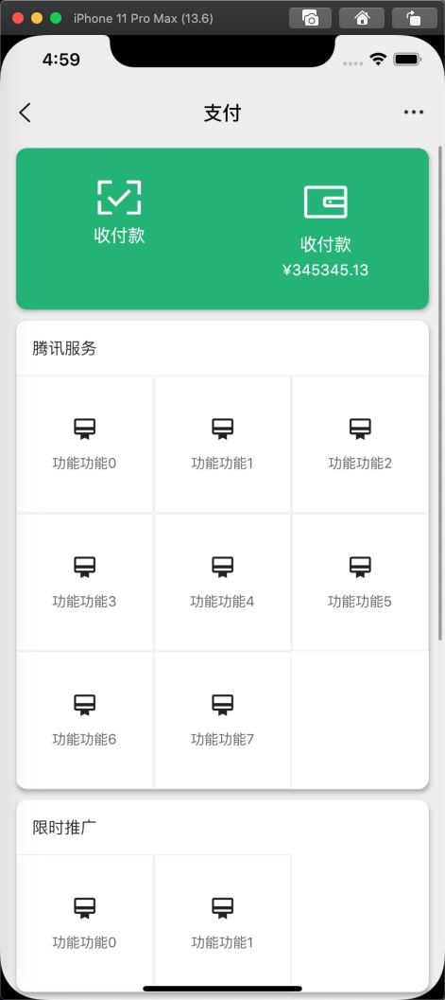                        |  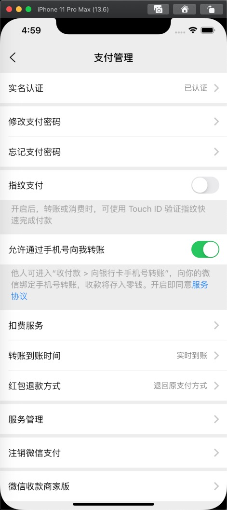                  |
|     |     |   |   |

<br>

## <a id="Licenses"></a> 开源协议
<details open id="Licenses">
  <summary><strong>Licenses</strong></summary>

```

BSD 2-Clause License

Copyright (c) 2020, iotjin
All rights reserved.

Redistribution and use in source and binary forms, with or without
modification, are permitted provided that the following conditions are met:

1. Redistributions of source code must retain the above copyright notice, this
   list of conditions and the following disclaimer.

2. Redistributions in binary form must reproduce the above copyright notice,
   this list of conditions and the following disclaimer in the documentation
   and/or other materials provided with the distribution.

THIS SOFTWARE IS PROVIDED BY THE COPYRIGHT HOLDERS AND CONTRIBUTORS "AS IS"
AND ANY EXPRESS OR IMPLIED WARRANTIES, INCLUDING, BUT NOT LIMITED TO, THE
IMPLIED WARRANTIES OF MERCHANTABILITY AND FITNESS FOR A PARTICULAR PURPOSE ARE
DISCLAIMED. IN NO EVENT SHALL THE COPYRIGHT HOLDER OR CONTRIBUTORS BE LIABLE
FOR ANY DIRECT, INDIRECT, INCIDENTAL, SPECIAL, EXEMPLARY, OR CONSEQUENTIAL
DAMAGES (INCLUDING, BUT NOT LIMITED TO, PROCUREMENT OF SUBSTITUTE GOODS OR
SERVICES; LOSS OF USE, DATA, OR PROFITS; OR BUSINESS INTERRUPTION) HOWEVER
CAUSED AND ON ANY THEORY OF LIABILITY, WHETHER IN CONTRACT, STRICT LIABILITY,
OR TORT (INCLUDING NEGLIGENCE OR OTHERWISE) ARISING IN ANY WAY OUT OF THE USE
OF THIS SOFTWARE, EVEN IF ADVISED OF THE POSSIBILITY OF SUCH DAMAGE.

```

</details>